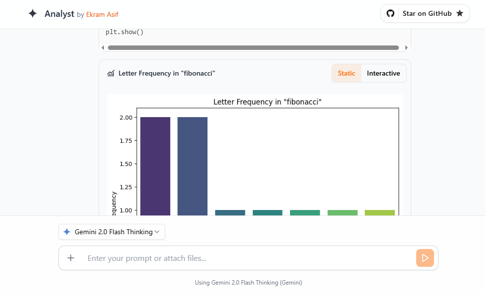

# AI Analyst
This is an AI-powered code and data analysis tool built with Next.js and Gemini.




## Features
- 🔸 Analyze data with Google's Gemini
- 🔸 Upload CSV files
- 🔸 Create interactive charts

**Powered by:**
- 🔸 Google's Gemini
- 🔸 ✶ [E2B Sandbox](https://github.com/e2b-dev/code-interpreter)
- 🔸 Vercel's AI SDK
- 🔸 Next.js
- 🔸 echarts library for interactive charts

**Supported LLM Providers:**
- 🔸 Gemini 2.0 Flash
- 🔸 Gemini 2.5 Pro


## Get started


### 1. Clone repository
```
git clone https://github.com/ekramasif/ai-analyst.git
```

### 2. Install dependencies
```
cd ai-analyst && npm i
```

### 3. Get API keys
Copy `.example.env` to `.env.local` and fill in variables for E2B and one LLM provider.

E2B: `E2B_API_KEY`

- Get your [E2B API key here](https://e2b.dev/dashboard?tab=keys).
# ai-analyst
